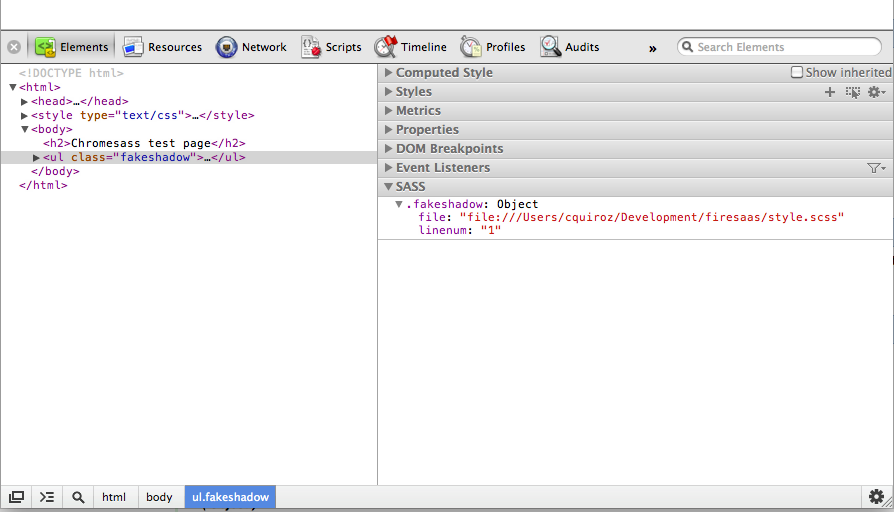

chrass
======

Change Log
----------

## Version 0.2
This release provides a sidebar that interacts with the elements tree.

If the page has sass debug info, a sidebar in the developer tools will appear.
The elements tree is scanned and if the user selects an element with sass data
it will show the filename and line number for that element.

This is shown in the screenshot below

Support is still fairly limited but should be able to detect the basic case of an element with a sass class.

Note that the file address are stored as absolute paths by sass.

## Version 0.1
This is the initial release. The extension works when the developer tools are opened. It reads the page, searches for stylesheets and tries to determine if the css contains sass debug info.

If the stylesheets are generated with sass a static page is added to the Saas sidebar. The sidebar only exist if pages have the sass debug info.

For a test page go to http://ketalo.com/chromesass/test.html
